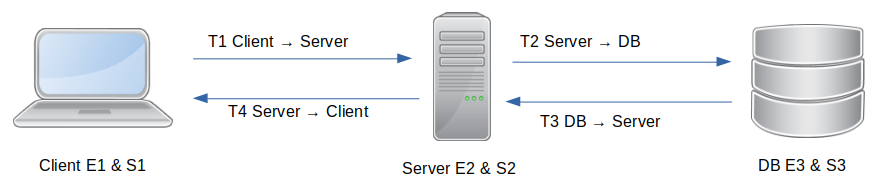
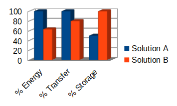

<!--
SPDX-FileCopyrightText: 2023 Davidson <twister@davidson.fr>
SPDX-License-Identifier: CC-BY-NC-SA-4.0
-->

[](https://api.reuse.software/info/github.com/fsfe/reuse-tool)

# ETSdiff

**ETSdiff** aims at the **differential analysis** of **solutions** producing an **identical result** within the framework of a **complete chain** of web applications.



**To cover the whole chain, ETSdiff uses 3 distinct indicators:**
* **E**: Energy (in joules) Ex: E1 + E2 + E3
* **T**: Transfer (in octets) Ex: T1 + T2 + T3 + T4
* **S**: Storage (in octets) Ex: S1 + S2 + S3



* The solutions to be compared must guarantee an identical result for the same query and be reproducible.
* The measurement process must be carried out in a controlled test environment

## Prerequisite

*Temporary process before the v1.0 that provide a deb package*

**ETSdiff and dependencies need to works with privileged access -> so you need to be in sudoer list**

1. Install [vjoule](https://github.com/davidson-consulting/vjoule/releases/tag/v0.2) from deb package
    * update `/etc/vjoule/cgroups` by adding `"etsdiff.slice"` into `slices`
1. Ubuntu depenencies:
    * `sudo apt install tshark`
1. Install [rust language](https://www.rust-lang.org/tools/install) 


## Getting started
Hey, from now it's simple as Rust so 
```
cargo build
cargo run
```

### Using (cli help)

```
ETSDiff 0.1
Twister <twister@davidson.fr>
Comparing programs with 3 criterias: Energy, Transfer and Storage

USAGE:
    etsdiff [OPTIONS] <config>

ARGS:
    <config>    TOML config file

OPTIONS:
    -h, --help             Print help information
    -o, --output <FILE>    YAML output file
    -V, --version          Print version information
```

### Configuration file

**As we are in beta stage, we don't provide exhaustive informations about config file.**

*At this stage there is no validation of configuration values (planned in [issue 9](https://github.com/davidson-consulting/ETSdiff/issues/9))*

But you can see one example [here](https://github.com/davidson-consulting/ETSdiff-Test-Snippets/blob/main/php/sql_index/ets.toml) and check the one used in [test](https://github.com/davidson-consulting/ETSdiff/blob/29dd34fff1740d6ba31e5631cf52d724031656e2/src/ets/config_reader.rs#L124).

### Output

Output consist of one YAML file that contains details for all tests and the total (using median value).

*Overview of a 2 iterations run:*
```
details:
- name: Index
  energy: 0.09502
  transfer: 33237
  storage: 629159923
- name: NoIndex
  energy: 11.55157
  transfer: 33373
  storage: 373307379
- name: Index
  energy: 0.08891999999999999
  transfer: 33237
  storage: 629159923
- name: NoIndex
  energy: 11.658760000000001
  transfer: 33373
  storage: 373307379
total:
- name: Index
  energy: 0.09197
  transfer: 33237
  storage: 629159923
- name: NoIndex
  energy: 11.605165
  transfer: 33373
  storage: 373307379
```

## License

This work is licensed under multiple licences. Because keeping this section
up-to-date is challenging, here is a brief summary:

- All original source code is licensed under GPL-3.0-or-later.
- All documentation is licensed under CC-BY-SA-4.0.
- Some configuration and data files are licensed under CC0-1.0.

For more accurate information, check the individual files.
